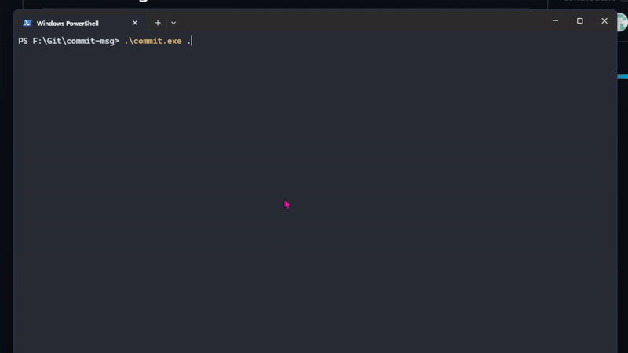

# commit-msg

[](https://hacktoberfest.com/)
[](https://golang.org/)
[](LICENSE)


`commit-msg` is a command-line tool that generates commit messages using LLM (Large Language Models). It is designed to help developers create clear and concise commit messages for their Git repositories automatically by analyzing your staged changes.

## Screenshot

Below is a sample execution of `commit-msg`:



## Before running the application, set LLM and API Key using "commit llm setup"

## 🎃 Hacktoberfest 2025

This project is participating in **Hacktoberfest 2025**! We welcome contributions from developers of all skill levels.

Looking to contribute? Check out:

- [Good First Issues](https://github.com/dfanso/commit-msg/labels/good%20first%20issue)
- [Help Wanted Issues](https://github.com/dfanso/commit-msg/labels/help%20wanted)
- [Contributing Guidelines](CONTRIBUTING.md)

## Features

✨ **AI-Powered Commit Messages** - Automatically generate meaningful commit messages  
🔄 **Multiple LLM Support** - Choose between Google Gemini, Grok, Claude, ChatGPT, or Ollama (local)  
🧪 **Dry Run Mode** - Preview prompts without making API calls  
📝 **Context-Aware** - Analyzes staged and unstaged changes  
📋 **Auto-Copy to Clipboard** - Generated messages are automatically copied for instant use  
🎛️ **Interactive Review Flow** - Accept, regenerate with new styles, or open the message in your editor before committing  
📊 **File Statistics Display** - Visual preview of changed files and line counts  
💡 **Smart Security Scrubbing** - Automatically removes API keys, passwords, and sensitive data from diffs  
🚀 **Easy to Use** - Simple CLI interface with beautiful terminal UI  
⚡️ **Fast** - Quick generation of commit messages

## Supported LLM Providers

You can use **Google Gemini**, **Grok**, **Claude**, **ChatGPT**, or **Ollama** (local) as the LLM to generate commit messages:

## 🔒 Security & Privacy

`commit-msg` automatically scrubs sensitive data from your code before sending it to LLM providers:

- **API Keys & Tokens** - OpenAI, Gemini, Claude, GitHub, Slack, AWS credentials
- **Passwords & Secrets** - Database passwords, JWT tokens, private keys
- **Personal Data** - Email addresses, credit card numbers
- **Environment Variables** - Automatic detection and redaction of sensitive `.env` files

All scrubbing happens locally before any data leaves your machine, ensuring your secrets stay secure.

---

## 📦 Installation

### Option 1: Download Pre-built Binary (Recommended)

1. Download the latest release from the [GitHub Releases](https://github.com/dfanso/commit-msg/releases) page
2. Extract the executable to a directory
3. Add the directory to your system PATH:

   **Windows:**

   ```cmd
   setx PATH "%PATH%;C:\path\to\commit-msg"
   ```

   **Linux/macOS:**

   ```bash
   export PATH=$PATH:/path/to/commit-msg
   echo 'export PATH=$PATH:/path/to/commit-msg' >> ~/.bashrc  # or ~/.zshrc
   ```

### Option 2: Build from Source

Requirements: Go 1.23.4 or higher

```bash
# Clone the repository
git clone https://github.com/dfanso/commit-msg.git
cd commit-msg

# Install dependencies
go mod download

# Build the executable
go build -o commit cmd/commit-msg/main.go

# (Optional) Install to GOPATH
go install
```

---

## 🚀 Usage

### Basic Usage

Navigate to any Git repository and run:

```bash
commit .
```

Or if running from source:

```bash
go run cmd/commit-msg/main.go .
```

### Preview Mode (Dry Run)

Preview what would be sent to the LLM without making an API call:

```bash
commit . --dry-run
```

This displays:
- The LLM provider that would be used
- The exact prompt that would be sent
- File statistics and change summary
- Estimated token count
- All without consuming API credits or sharing data

Perfect for:
- 🐛 **Debugging** - See exactly what prompt is being sent
- 💰 **Cost Control** - Review before consuming API credits
- 🔒 **Privacy** - Verify what data would be shared with external APIs
- 🧪 **Development** - Test prompt changes without API calls

### Setup LLM and API Key

```bash
  commit llm setup
```


### Update LLM

```bash
  commit llm update
```


### Example Workflow

```bash
# Make changes to your code
echo "console.log('Hello World')" > app.js

# Stage your changes
git add .

# Generate commit message
commit .

# The tool will display:
# - File statistics (staged, unstaged, untracked)
# - Generated commit message in a styled box
# - Automatically copy to clipboard
# Output: "feat: add hello world console log to app.js"
# You can now paste it with Ctrl+V (or Cmd+V on macOS)
```

### Interactive Commit Workflow

Once the commit message is generated, the CLI now offers a quick review loop:

- **Accept & copy** – use the message as-is (it still lands on your clipboard automatically)
- **Regenerate** – pick from presets like detailed summaries, casual tone, bug-fix emphasis, or provide custom instructions for the LLM
- **Edit in your editor** – open the message in `$GIT_EDITOR`, `$VISUAL`, `$EDITOR`, or a sensible fallback (`notepad` on Windows, `nano` elsewhere)
- **Exit** – leave without copying anything if the message isn't ready yet

This makes it easy to tweak the tone, iterate on suggestions, or fine-tune the final wording before you commit.

### Use Cases

- 📝 Generate commit messages for staged changes
- 🔍 Analyze both staged and unstaged changes
- 📊 Get context from recent commits and file statistics
- ✅ Create conventional commit messages
- 📋 Auto-copy to clipboard for immediate use
- 🎨 Beautiful terminal UI with file statistics and previews

---

## 🔧 Configuration

### Set LLM and API Keys

```bash
  commit llm setup
```

### Update LLM

```bash
  commit llm update
```

### Set LLM as default

```bash
Select: Set Default
```

### Change API Key

```bash
Select: Change API Key
```

### Delete LLM

```bash
Select: Delete
```

---

## Getting API Keys

**Google Gemini:**

1. Visit [Google AI Studio](https://makersuite.google.com/app/apikey)
2. Create a new API key

**Grok (X.AI):**

1. Visit [X.AI Console](https://console.x.ai/)
2. Generate an API key

**Groq:**

1. Sign up at [Groq Cloud](https://console.groq.com/)
2. Create an API key

**Claude (Anthropic):**

1.  Visit the [Anthropic Console](https://console.anthropic.com/)
2.  Create a new API key

**OpenAI (ChatGPT):**

1. Visit [OpenAI Platform](https://platform.openai.com/api-keys)
2. Create a new API key

**Ollama (Local LLM):**

1. Install Ollama: Visit [Ollama.ai](https://ollama.ai/) and follow installation instructions
2. Start Ollama: `ollama serve`
3. Pull a model: `ollama pull llama3.1`
4. Set environment variables:
   ```bash
   export COMMIT_LLM=ollama
   export OLLAMA_MODEL=llama3.1  # llama3.1 by default
   ```

---

## 🤝 Contributing

We welcome contributions! Please see our [Contributing Guidelines](CONTRIBUTING.md) for details.

### Quick Start for Contributors

1. Fork the repository
2. Create a feature branch: `git checkout -b feature/amazing-feature`
3. Make your changes
4. Commit your changes: `git commit -m 'feat: add amazing feature'`
5. Push to the branch: `git push origin feature/amazing-feature`
6. Open a Pull Request

### Areas Where We Need Help

- 🐛 Bug fixes
- ✨ New LLM provider integrations (OpenAI, Claude, etc.)
- 📚 Documentation improvements
- 🧪 Test coverage
- 🌍 Internationalization
- ⚡ Performance optimizations

---

## 📄 License

This project is licensed under the MIT License - see the [LICENSE](LICENSE) file for details.

---

## 🙏 Acknowledgments

- Thanks to all [contributors](https://github.com/dfanso/commit-msg/graphs/contributors)
- Google Gemini and X.AI Grok for providing LLM APIs
- The open-source community

---

## 📞 Support

- 🐛 [Report a Bug](https://github.com/dfanso/commit-msg/issues/new?template=bug_report.md)
- 💡 [Request a Feature](https://github.com/dfanso/commit-msg/issues/new?template=feature_request.md)
- 💬 [Ask a Question](https://github.com/dfanso/commit-msg/issues)

---

Made with ❤️ for Hacktoberfest 2025
